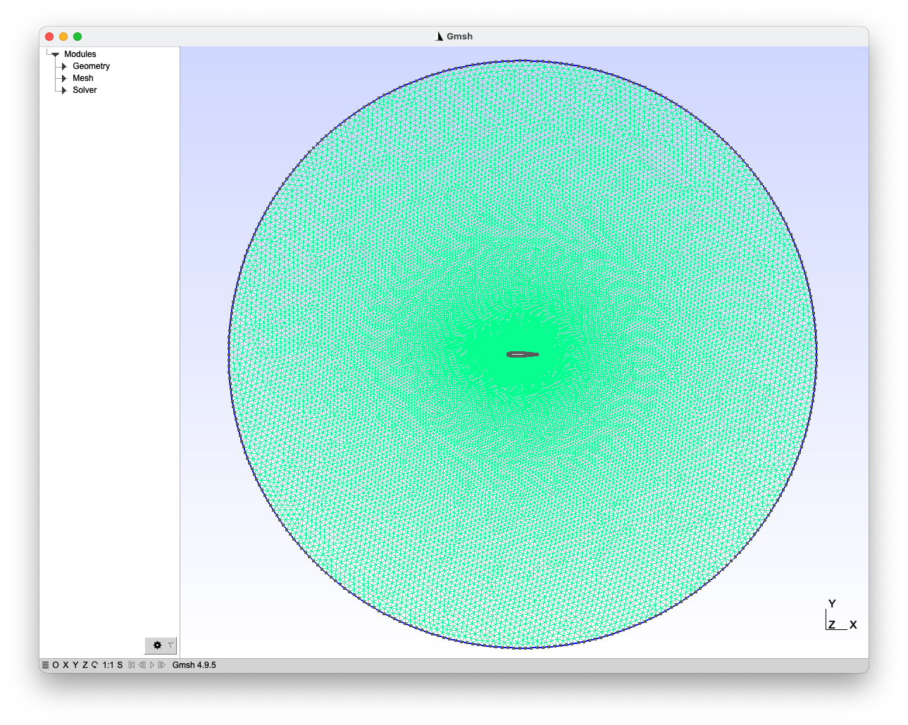
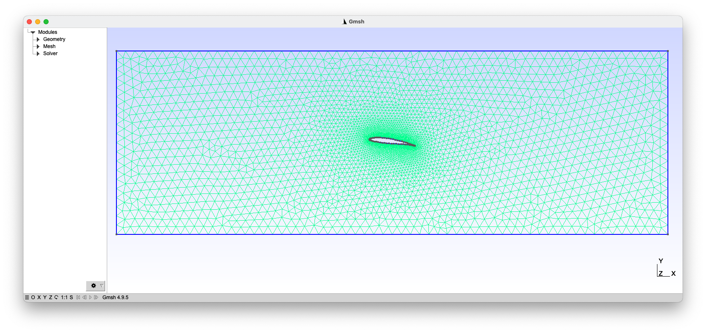
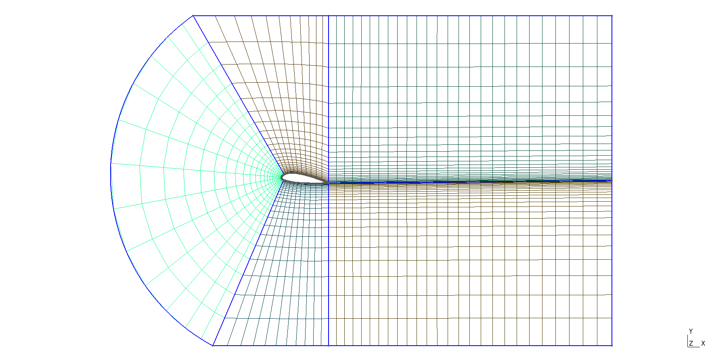

[](https://github.com/cfsengineering/GMSH-Airfoil-2D/actions/workflows/pytest.yml)
[](https://pypi.python.org/pypi/gmshairfoil2d)
[](https://github.com/cfsengineering/GMSH-Airfoil-2D/blob/main/LICENSE)
[](https://github.com/psf/black)

# GMSH-Airfoil-2D

Python tool to genreate 2D unstructured mesh around an airfoil with [GMSH](https://gmsh.info/) in one command line.

## Installation

You can install this package from PyPi:

```bash
pip install gmshairfoil2d
```

Or you can clone and install this repository with the following commands:

```bash
git clone https://github.com/cfsengineering/GMSH-Airfoil-2D.git
cd GMSH-Airfoil-2D
pip install -e .
```

## Usage

```text
gmshairfoil2d -h                                    

optional arguments:
  -h, --help                  Show this help message and exit
  --list                      Display all airfoil available in the database :
                              https://m-selig.ae.illinois.edu/ads/coord_database.html
  --naca [4DIGITS]            NACA airfoil 4 digit
  --airfoil [NAME]            Name of an airfoil profile in the database (database available with
                              the --list argument)
  --aoa [AOA]                 Angle of attack [deg] (default: 0 [deg])
  --farfield [RADIUS]         Create a circular farfield mesh of given radius [m] (default 10m)
  --box [LENGTHxWIDTH]        Create a box mesh of dimensions [length]x[height] [m]
  --airfoil_mesh_size [SIZE]  Mesh size of the airfoil contour [m] (default 0.01m)
  --ext_mesh_size [SIZE]      Mesh size of the external domain [m] (default 0.2m) (for normal, bl
                              and structural)
  --no_bl                     Do the unstructured meshing (with triangles), without a boundary
                              layer
  --first_layer [HEIGHT]      Height of the first layer [m] (default 3e-5m) (for bl and structural)
  --ratio [RATIO]             Growth ratio of layers (default 1.2) (for bl and structural)
  --nb_layers [INT]           Total number of layers in the boundary layer (default 35)
  --format [FORMAT]           Format of the mesh file, e.g: msh, vtk, wrl, stl, mesh, cgns, su2,
                              dat (default su2)
  --structural                Generate a structural mesh
  --arg_struc [LxLxL]         Parameters for the structural mesh [leading (axis x)]x[wake (axis
                              x)]x[total height (axis y)] [m] (default 1x10x10)
  --output [PATH]             Output path for the mesh file (default : current dir)
  --ui                        Open GMSH user interface to see the mesh

```

## Examples of use

To check all airfoil available in the [database](https://m-selig.ae.illinois.edu/ads/coord_database.html):

```bash
gmshairfoil2d --list
```

For all the following examples, the defauld chord lenght is 1 meter.

To create a circular farfield mesh around a NACA0012 of 10m of radius and see the result with GMSH user interface:

```bash
gmshairfoil2d --naca 0012 --farfield 10 --ui --no_bl
```



To create a circular farfield mesh with boudary layer around a Drela DAE11 airfoil (the name in the database is "dae11") of 4m or radius with a mesh size of 0.005m on the airfoil (but to not open on the interface):

```bash
gmshairfoil2d --airfoil dae11 --farfield 4 --airfoil_mesh_size 0.005
```

To create mesh around a Eppler E220 airfoil (the name in the database is "e211") with an angle of attack of 8 degree in a box of 12x4m (lenght x height) and save it as a vtk mesh and see the result with GMSH user interface:

```bash
gmshairfoil2d --airfoil e211 --aoa 8 --box 12x4 --format vtk --ui --no_bl
```




To create a boxed mesh around a NACA 11-H-09 airfoil (the name in the database is "n11h9"), using the boundary layer with default parameters (first layer of height 3e-5, 35 layers and growth ratio of 1.2)

```bash
gmshairfoil2d --airfoil n11h9 --ui --box 2x1.4
```


To create a structural mesh around a Naca 4220 airfoil (the 4 digits code is obviously "4220"), with first layer height of 0.0006, leading length of 1, wake length of 7, height of 6, and angle of attack of 7 degrees

```bash
 gmshairfoil2d --naca 4220 --ui --structural --first_layer 0.01 --arg_struc 1x6x7 --aoa 7
```


